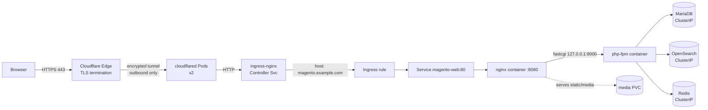

# Architecture

## Traffic path (internet → PHP-FPM)

Key points:
- **TLS terminates at Cloudflare's edge.** The tunnel is an *outbound* connection
  from `cloudflared` to Cloudflare, so there is no inbound port, no public IP, and
  no router/firewall port-forward. The data tier can never be reached from the
  internet.
- The **Ingress stays in the path**: cloudflared
  forwards to the ingress-nginx controller Service, which routes by host to
  `magento-web`.
- **nginx and PHP-FPM are separated** into two containers in one Pod. nginx serves
  static/media directly and proxies only dynamic requests to php-fpm over
  loopback.

## Component responsibilities

| Component | Kind | Why | Persistence |
|-----------|------|-----|-------------|
| `magento-web` | Deployment (nginx + php-fpm) | Stateless web tier, horizontally scalable | none (code baked in image) |
| `magento-cron` | Deployment (1 replica) | Indexers, scheduled tasks, queue consumers | none |
| `magento-install` | Job (helm hook) | Idempotent install/upgrade + product seed | n/a |
| `mariadb` | StatefulSet | Stable identity + stable PVC for the DB | PVC (volumeClaimTemplate) |
| `opensearch` | StatefulSet | Search engine; index survives restarts | PVC (volumeClaimTemplate) |
| `redis` | Deployment | Cache + FPC + sessions; reconstructible | none (ephemeral by design) |
| `cloudflared` | Deployment (2 replicas) | Public exposure via Cloudflare Tunnel | none |
| `magento-media` | PVC | Product images + uploads shared by web pods | PVC |

## Why these choices

- **StatefulSet for MariaDB/OpenSearch** — stable network identity and a stable,
  per-replica PVC via `volumeClaimTemplates`; the natural fit for stateful data.
- **Deployment for the web tier** — it is stateless (session + cache in Redis,
  media on a shared PVC, code baked into the image), so it scales horizontally and
  rolls out with zero downtime.
- **Redis without a PVC** — cache and sessions are reconstructible; persisting them
  adds cost and failure modes for no benefit. It *is* required for safe
  multi-replica (shared session + cache backend).
- **env.php rendered at pod start** from ConfigMap+Secret — keeps config out of the
  image and makes every web pod identical and stateless.
- **DB lock provider** (`'lock' => ['provider' => 'db']`) instead of file locks, so
  locking is correct across multiple pods.

## Config vs secret separation

| ConfigMap `magento-config` (non-secret) | Secret `magento-secret` |
|---|---|
| domain, base_url, admin path, run mode | DB app + root passwords |
| language, currency, timezone | Magento admin password |
| DB/OpenSearch/Redis **hostnames + ports** | Magento crypt key |
| PHP-FPM pool sizing | (build, optional) marketplace auth keys |
| | (Secret `cloudflare-tunnel`) tunnel token |
